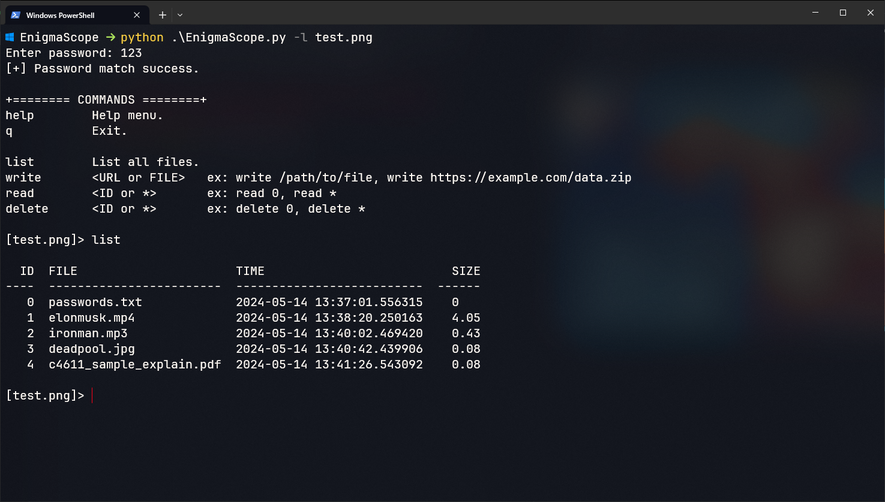

# EnigmaScope "Hide any type of file in any type of file"
- EnigmaScope is a flexible Python utility that hides and encapsulates several components into a single container.

### This dragon wallpaper is a secure image that includes text, pdf, mp4, mp3, etc.

### To test dragon wallpaper `secure.png`. The password is `123`.

