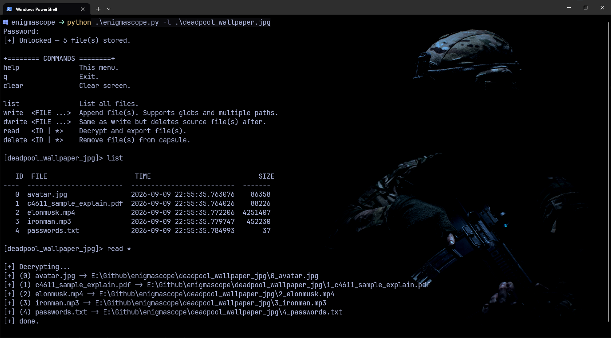

<p align="center">
    
</p>

<h1 align="center">EnigmaScope</h1>

<p align="center">
    Hide encrypted files inside any binary file — images, videos, PDFs, and more.
</p>

## Installation

```bash
git clone https://github.com/madhanmaaz/EnigmaScope.git
cd EnigmaScope
pip install -r requirements.txt
```

## Usage

Load a carrier file to open or create a capsule:

```bash
python enigmascope.py --load deadpool_wallpaper.jpg
```

On first load, you will be prompted to set a password. On subsequent loads, you will be prompted to enter it.

## Commands

```
+======== COMMANDS ========+
  help               This menu.
  q                  Exit.
  clear              Clear screen.

  list               List all files.
  write  <FILE ...>  Append file(s). Supports globs and multiple paths.
  dwrite <FILE ...>  Same as write but deletes source file(s) after.
  read   <ID | *>    Decrypt and export file(s).
  delete <ID | *>    Remove file(s) from capsule.
+==========================+
```

**Examples**

```
[wallpaper]> write report.pdf
[wallpaper]> write /home/user/docs/*.txt
[wallpaper]> write a.txt b.txt c.txt

[wallpaper]> list
[wallpaper]> read 0
[wallpaper]> read *

[wallpaper]> delete 2
[wallpaper]> delete *
```

## Try it

The wallpaper below is a live capsule containing sample files (`txt`, `pdf`, `mp4`, `mp3`). Load it and use password `123` to explore the contents.

```bash
python enigmascope.py --load deadpool_wallpaper.jpg
```




> [!IMPORTANT]
> If the carrier file is edited or re-encoded by any external application (resized, re-compressed, converted), the appended hidden data will be lost with no way to recover it. Always keep an unmodified backup of the carrier file.
>
> There is no password recovery. If the password is forgotten, the encrypted contents cannot be retrieved.
